# Azure Networking : Enterprise Hybrid Network
## Overview

Create an Enterprise Hybrid Network with a Hub and Spoke Topology in the Azure Portal

### Hybrid Hub and Spoke Topology

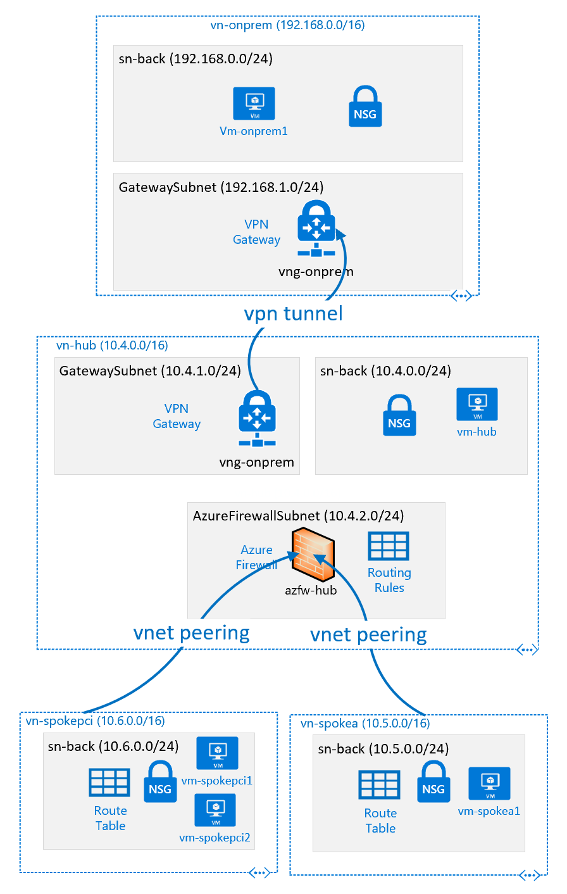

## Exercises

* [Create Virtual Networks](#create-virtual-networks)
* [Create VNET Peerings](#create-vnet-peerings)
* [Create Virtual Machines](#create-virtual-machines)
* [Create Network Security Groups](#create-network-security-groups)
* [Connect OnPrem to Hub via VPN Tunnel](#connect-onprem-to-hub-via-vpn-tunnel)
* [Create Azure Firewall](#create-azure-firewall)
* [Create User Defined Routes and Network Routing Rules](#create-user-defined-routes-and-network-routing-rules)

# Create Virtual Networks
## Create On Premises Network
### [Back to Excercises](#exercises)
* [Create On Premises Network](#create-on-premises-network)
* [Create Hub Network](#create-the-visual-studio-2017-solution)
* [Create SpokeA Network](#create-spokea-network)
* [Create SpokePCI Network](#create-spokepci-network)

1. Create a Resource Group named OnPrem
    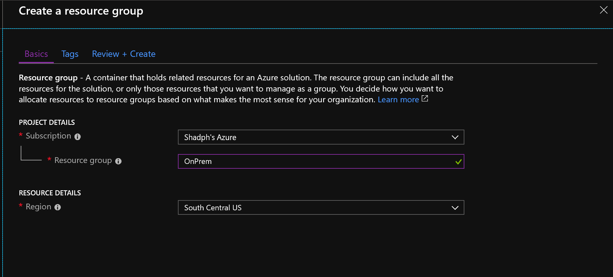
1. Create a Virtual Network in the OnPrem Resource Group
    * Name: vn-onprem
    * Address Space: 192.168.0.0/16
    * Resource Group: OnPrem
    * Region: South Central US
    * Subnet: sn-back
    * Subnet Address Range: 192.168.0.0/24
    * Leave other defaults, they can be changed later
    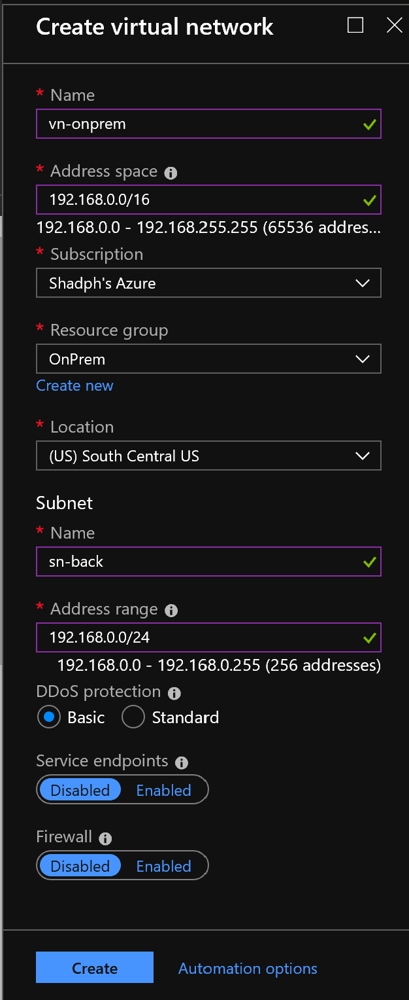
1. Add a Gateway Subnet to the OnPrem VNet
    * Click on +Gateway Subnet
    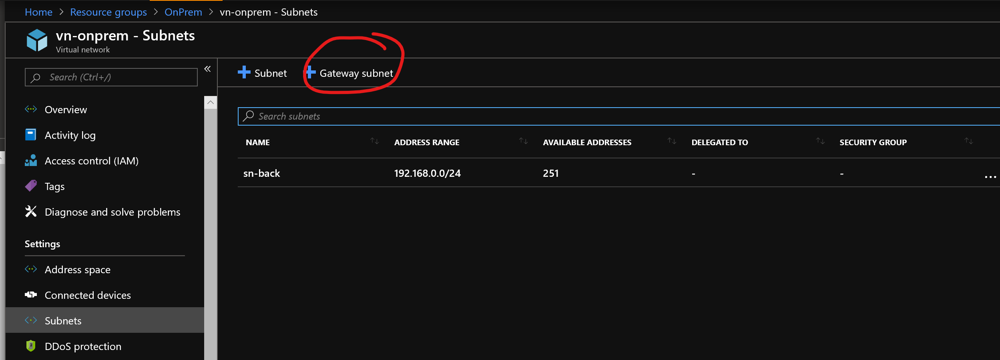
    * Accept the Defaults
    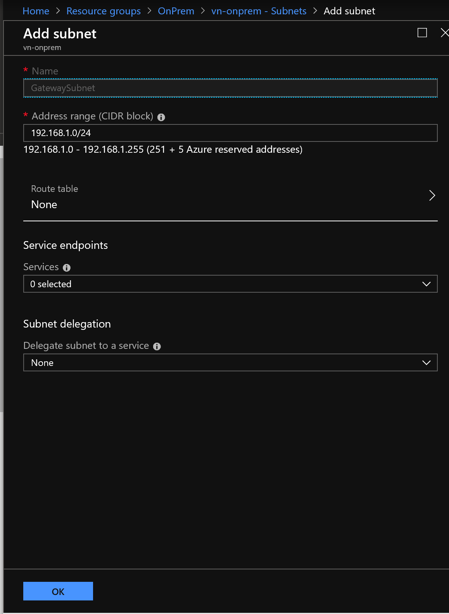
1. Deploy a VPN Gateway (This will take 30-40 mins)
    * Name: vng-onprem
    * Region: South Central US
    * Gateway Type: VPN
    * VPN Type: Route-Based
    * SKU: VpnGw1
    * Virtual Network: vn-onprem
    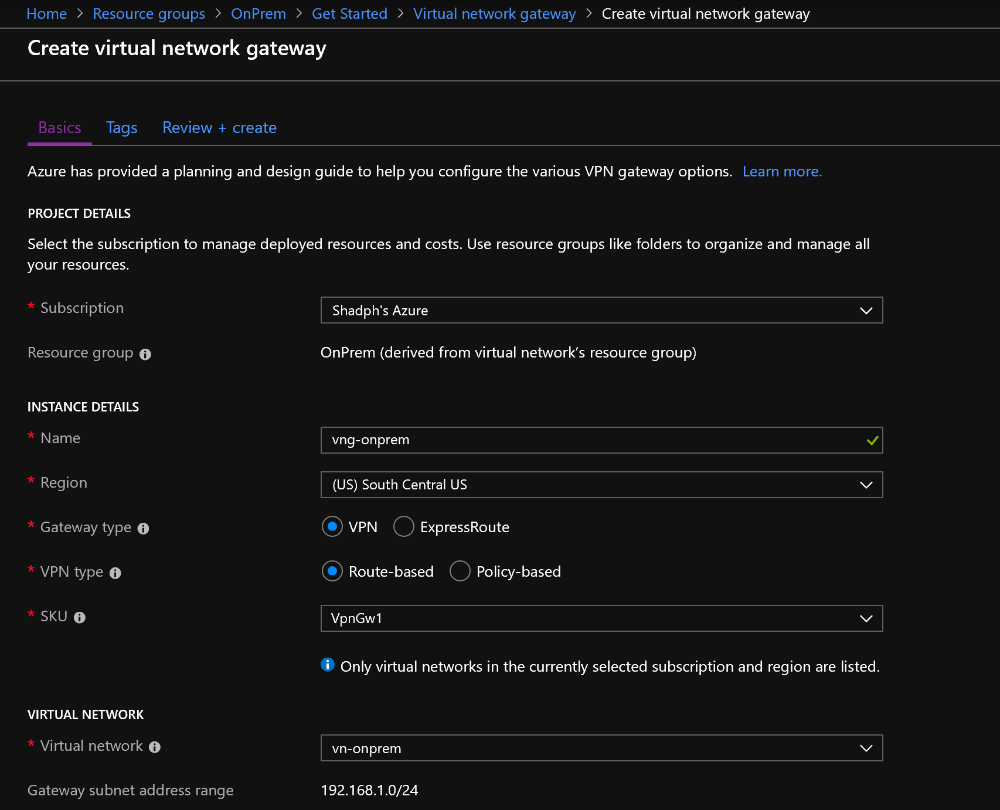
    * Create a new Public IP Address
    * Name: pip-vng-onprem
    * Leave all other defaults
    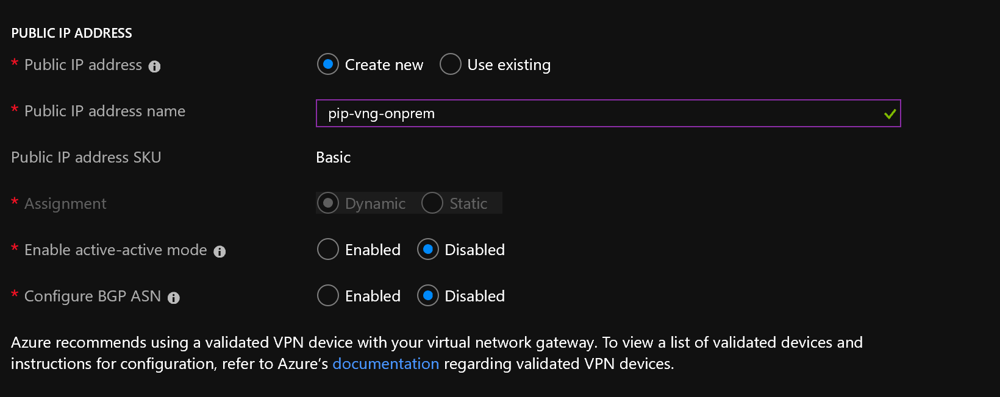
    * Click Review & Create > Create

## Create Hub Network
### [Back to Excercises](#exercises)

1. Create a Resource Group named Hub
    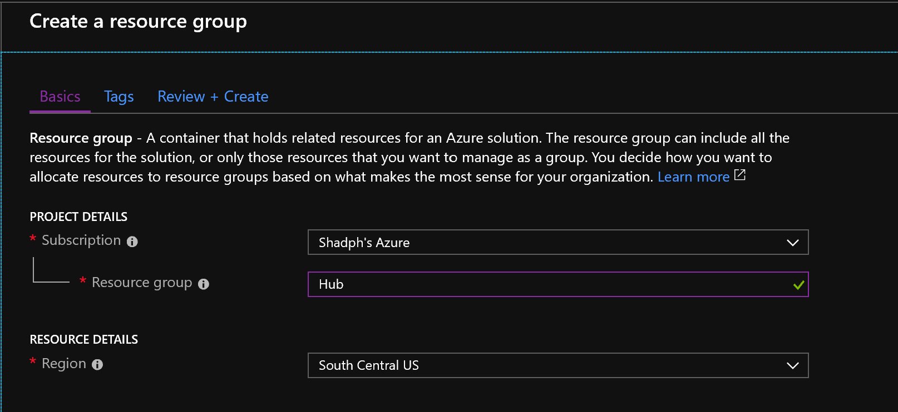
1. Create a Virtual Network in the Hub Resource Group
    * Name: vn-hub
    * Address Space: 10.4.0.0/16
    * Resource Group: Hub
    * Region: South Central US
    * Subnet: sn-back
    * Subnet Address Range: 10.4.0.0/24
    * Leave other defaults, they can be changed later
    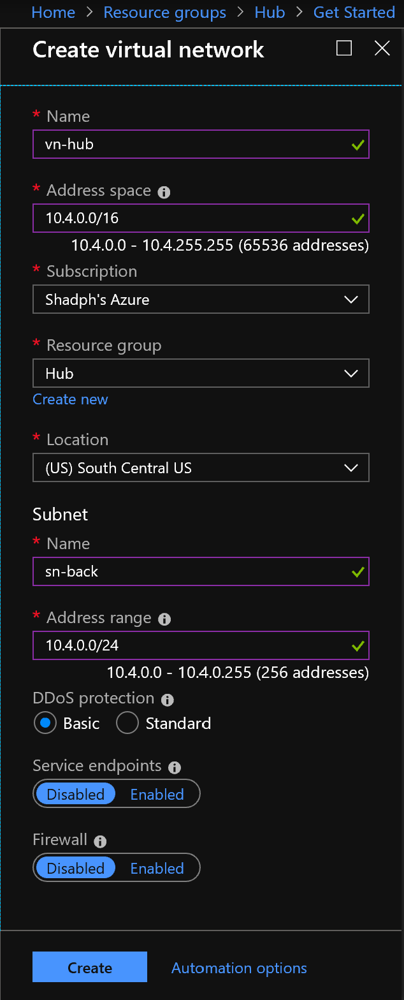
1. Add a Gateway Subnet to the Hub VNet
    * Click on +Gateway Subnet
    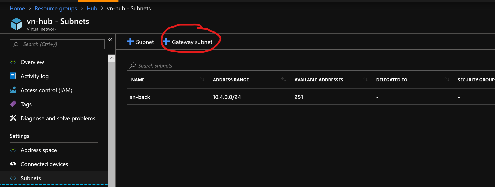
    * Accept the Defaults
    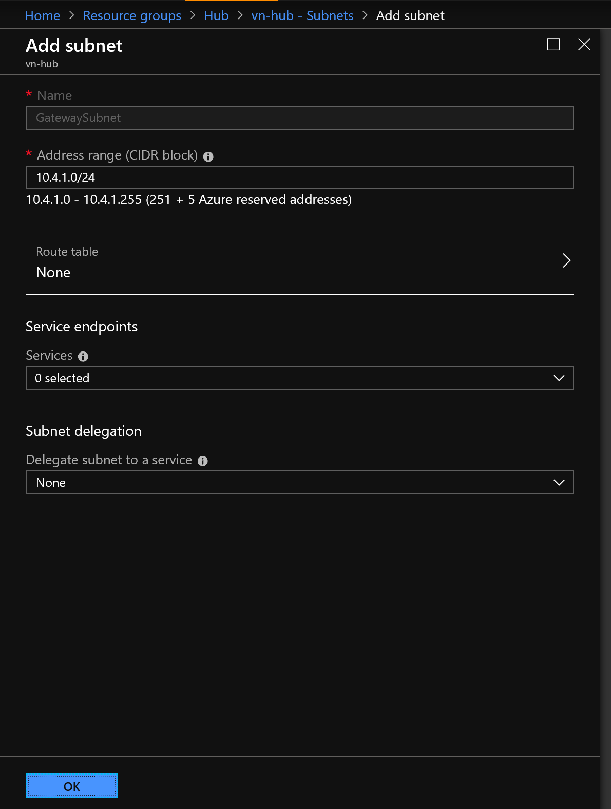
1. Deploy a VPN Gateway (This will take 30-40 mins)
    * Name: vng-hub
    * Region: South Central US
    * Gateway Type: VPN
    * VPN Type: Route-Based
    * SKU: VpnGw1
    * Virtual Network: vn-hub
    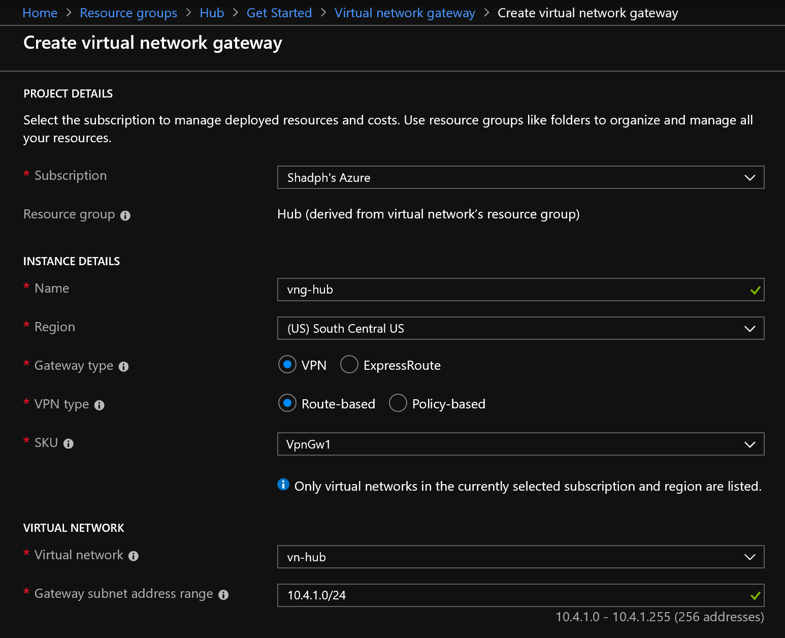
    * Create a new Public IP Address
    * Name: pip-vng-hub
    * Leave all other defaults
    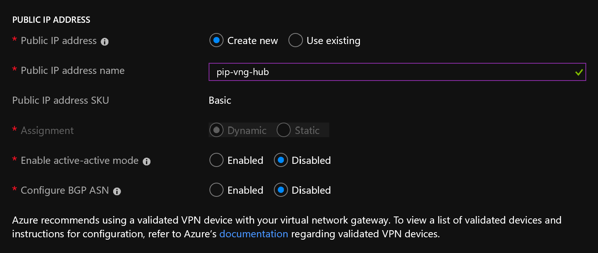
    * Click Review & Create > Create

## Create SpokeA Network
### [Back to Excercises](#exercises)

1. Create a Resource Group named SpokeA
    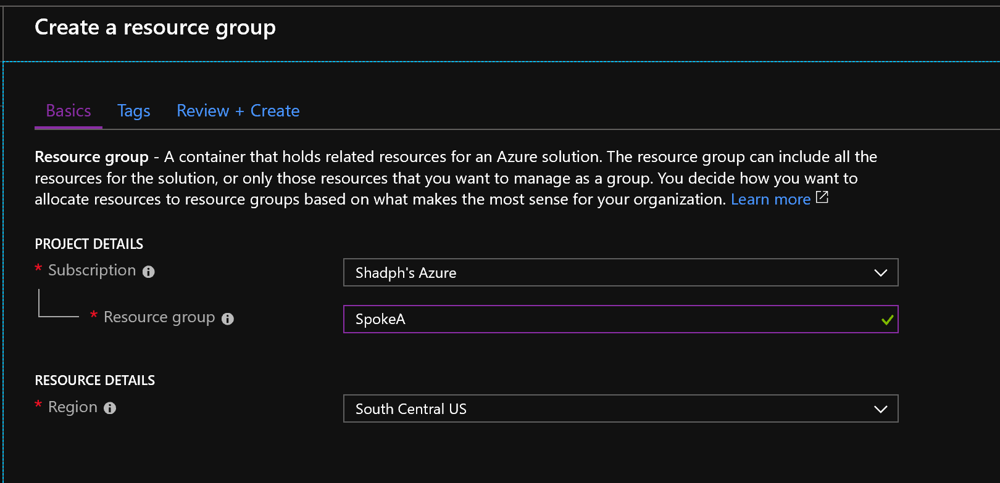
1. Create a Virtual Network in the Hub Resource Group
    * Name: vn-spokea
    * Address Space: 10.5.0.0/16
    * Resource Group: SpokeA
    * Region: South Central US
    * Subnet: sn-back
    * Subnet Address Range: 10.5.0.0/24
    * Leave other defaults, they can be changed later
    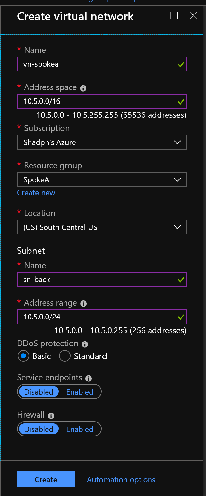
1. Add a App Subnet to the SpokeA VNet
    * Click on +Subnet
    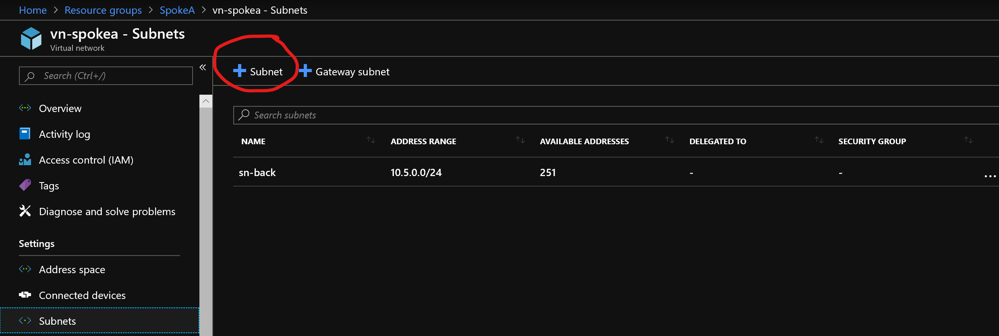
    * Name: vn-spokea
    * Address Range: 10.5.1.0/24
    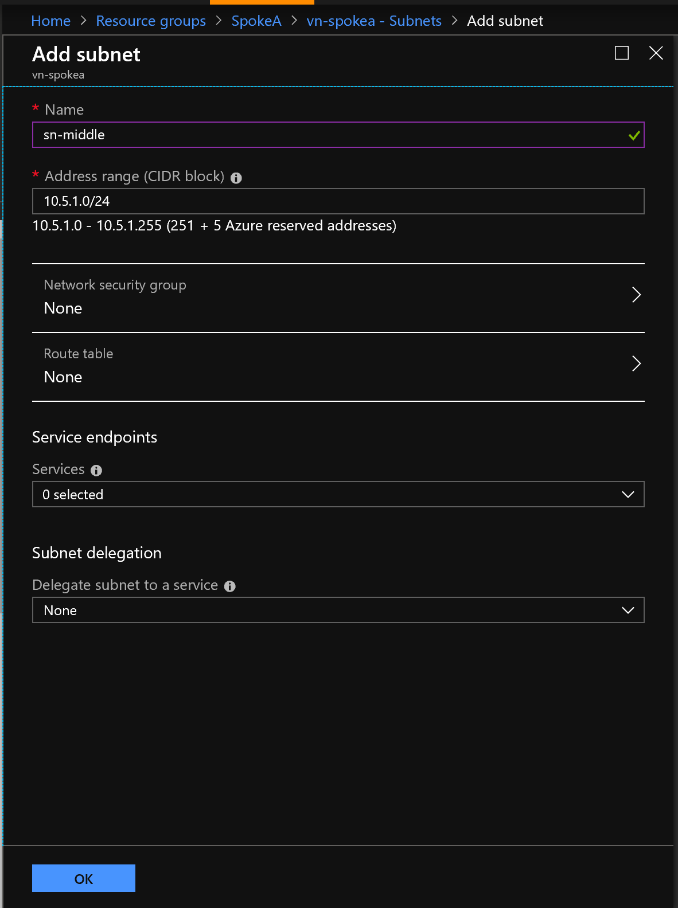

## Create SpokePCI Network
### [Back to Excercises](#exercises)

1. Create a Resource Group named SpokePCI
    
1. Create a Virtual Network in the Hub Resource Group
    * Name: vn-spokea
    * Address Space: 10.6.0.0/16
    * Resource Group: SpokePCI
    * Region: South Central US
    * Subnet: sn-back
    * Subnet Address Range: 10.6.0.0/24
    * Leave other defaults, they can be changed later
    
1. Add a App Subnet to the SpokeA VNet
    * Click on +Subnet
    
    * Name: vn-spokepci
    * Address Range: 10.6.1.0/24
    

# Create VNET Peerings
### [Back to Excercises](#exercises)
* [Create Hub to Spoke Peering](#create-hub-to-spokea-peering)
* [Create Spoke to Hub Peering](#create-spokea-to-hub-peering)

## Create Hub to Spoke Peering
    * Goal it to be able to get from SpokeA to OnPrem through the Hub
1. Navigate to the Hub Resource Group > vn-hub > peering > + Add

    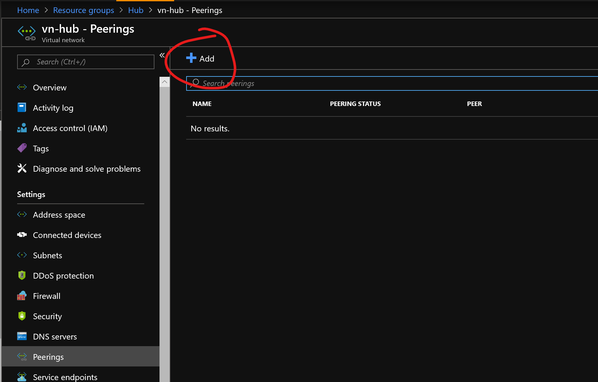
    * Name of peering from vn-hub to vn-spokea: pr-HubToSpokeA
    * Virtual Netowrk: vn-spokea
    * Name of peering from vn-spokea to vn-hub
    * Allow virutal network acess: Enabled
    * Allow Forwarded traffic from vn-hub to vn-spokea: Enabled
    * Allow Forwarded traffic from vn-spokea to vn-hub: Diabled
    * Allow Gateway transit: Checked
    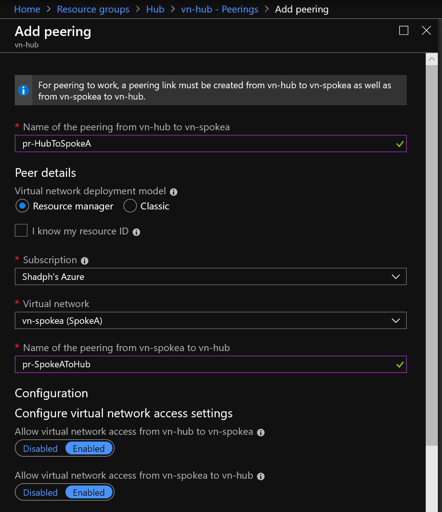
    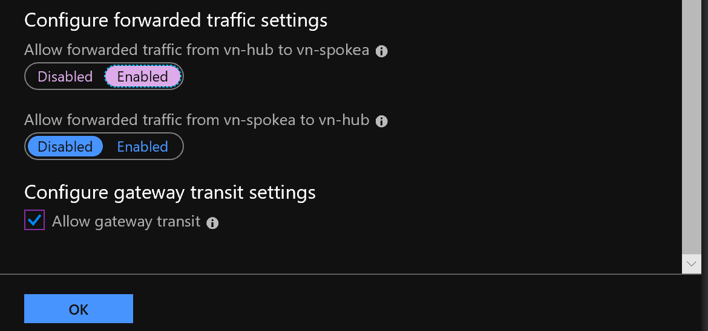

## Create Spoke to Hub Peering
### [Back to Excercises](#exercises)

    * Goal it to be able to get from SpokeA to SpokePCI and vise versa through the Hub
1. Navigate to the SpokeA Resource Group > vn-spokea > peering 
    * Let's validate that the peering is enabled correctly. You should see pr-SpokeAToHub

    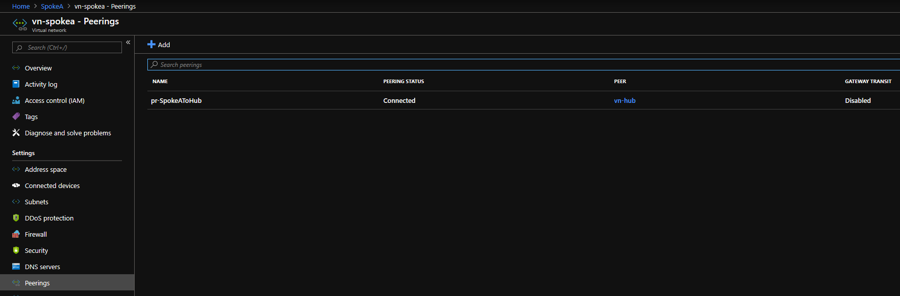

    * Click on pr-SpokeAToHub. You should see that "Use remote gateways" is checked.

    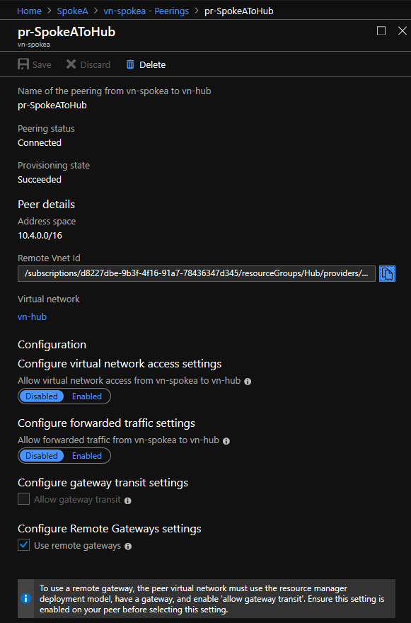

1. Navigate to the SpokeA Resource Group > vn-spokepci > peering 
    * Let's validate that the peering is enabled correctly. You should see pr-SpokeAToHub

    

    * Click on pr-SpokeAToHub. You should see that "Use remote gateways" is checked.

    

## Create Virtual Machines
### [Back to Excercises](#exercises)

### Create OnPrem VM
1. Click on + Create Resource in Portal
1. Choose Windows Server 2016 Datacenter
1. Basic Config
    
    * Resource Group: OnPrem
    * VM NAme: vm-onprem1
    * Region: South Central US
    * Availability Options: No infrastructure redundancy required
    * Image: Windows Server 2016 Datacenter
    * Size: Standard DS1 v2
    * UserName: <yourusername>
    * Password: <strongpassword>
    * Public inbound ports: Allowed Selected Ports (RDP)

     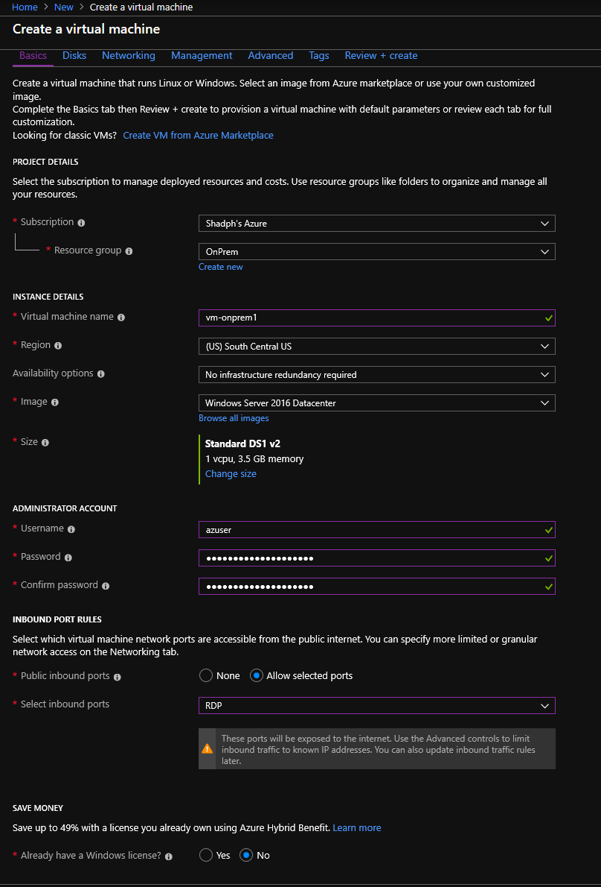
1. Disks
    * Leave Defaults

    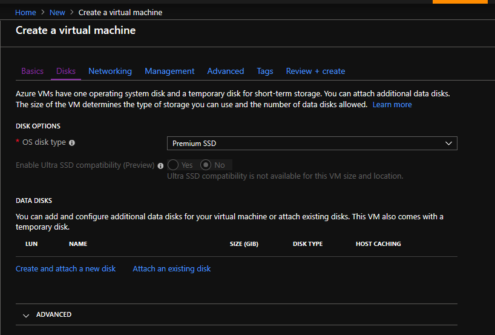
1. Network
    * Virtual Network: vn-onprem
    * Subnet: sn-back
    * Public IP: defalut (new vm-onprem1-ip)
    * Network Security Group: None (we'll add one to the VNET/Subnet Later)
    * Leave all other defaults

    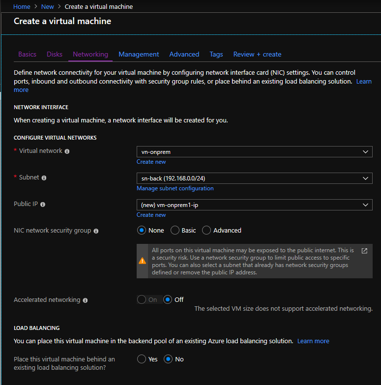

1. Click on Review + create > Create

### Create Hub VM
1. Click on + Create Resource in Portal
1. Choose Windows Server 2016 Datacenter
1. Basic Config
    
    * Resource Group: Hub
    * VM NAme: vm-hub1
    * Region: South Central US
    * Availability Options: No infrastructure redundancy required
    * Image: Windows Server 2016 Datacenter
    * Size: Standard DS1 v2
    * UserName: <yourusername>
    * Password: <strongpassword>
    * Public inbound ports: Allowed Selected Ports (RDP)

    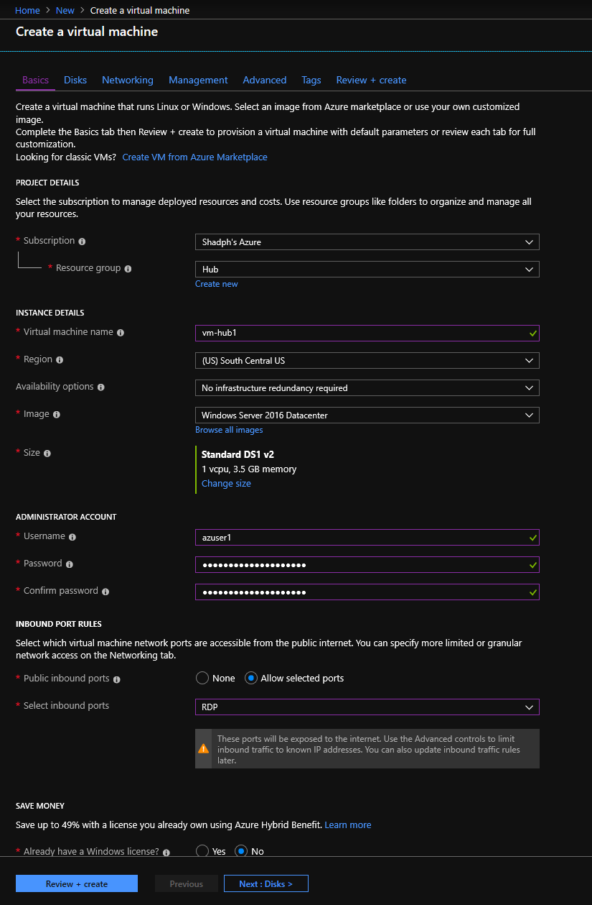
1. Disks
    * Leave Defaults

    
1. Network
    * Virtual Network: vn-hub
    * Subnet: sn-back
    * Public IP: defalut (new vm-hub1-ip)
    * Network Security Group: None (we'll add one to the VNET/Subnet Later)
    * Leave all other defaults
    
    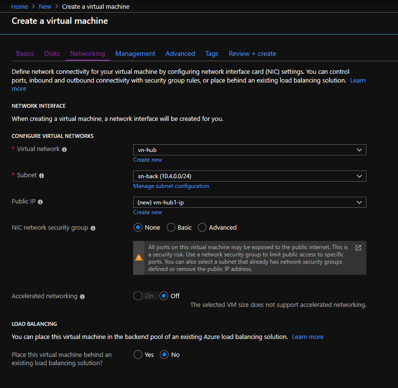

* Click on Review + create > Create

### Create SpokeA VM
1. Click on + Create Resource in Portal
1. Choose Windows Server 2016 Datacenter
1.  Basic Config

    * Resource Group: SpokeA
    * VM NAme: vm-spokea1
    * Region: South Central US
    * Availability Options: No infrastructure redundancy required
    * Image: Windows Server 2016 Datacenter
    * Size: Standard DS1 v2
    * UserName: <yourusername>
    * Password: <strongpassword>
    * Public inbound ports: Allowed Selected Ports (RDP)

    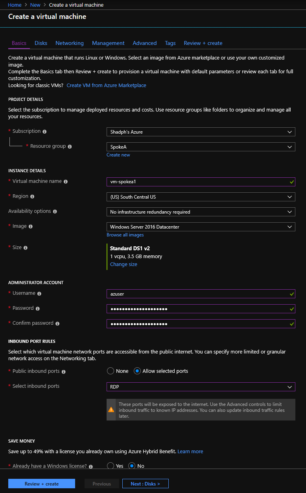

1. Disks
    * Leave Defaults

    

1. Network
    * Virtual Network: vn-spokea
    * Subnet: sn-back
    * Public IP: defalut (new vm-spokea1-ip)
    * Network Security Group: None (we'll add one to the VNET/Subnet Later)
    * Leave all other defaults

    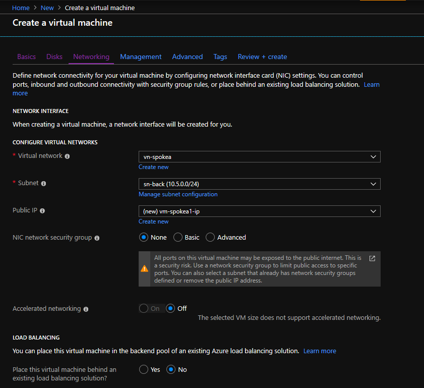

1. Click on Review + create > Create

## Create Network Security Groups
### [Back to Excercises](#exercises)

### Create OnPrem NSG

1. Click on + Create Resource in Portal
1. Type Network Security Group in Search Box
1. Select Network Security Group > Create
    * Name: nsg-onprem-back
    * Resource Group: OnPrem
    * Location: South Central US

    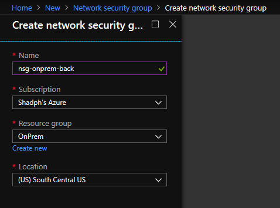
    * Navigate to Hub Resource Group > nsg-onprem-back 

    * Click on Subnets > + Associate  

    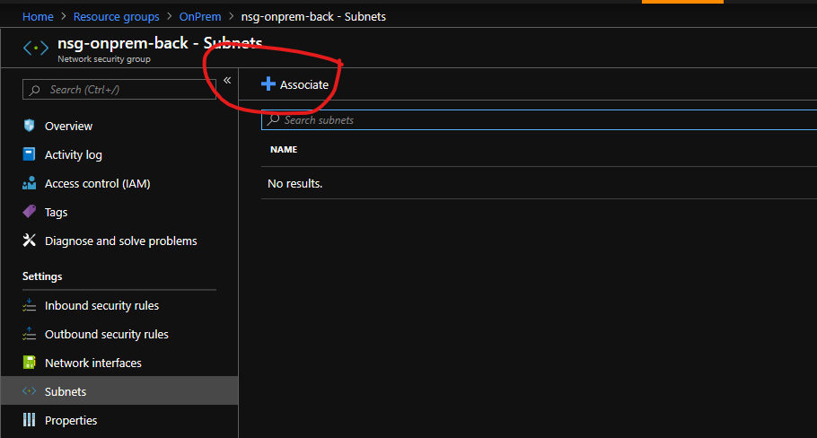
    * Virtual Network: vn-onprem
    * Subnet: sn-back

    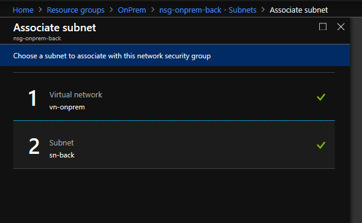

1. Add Inbound RDP Rule from your IP Address
    * Type whatismyipaddress in your favorite search engine, make note of your IP address
    * Click on Inbound Security Rules > + Add

    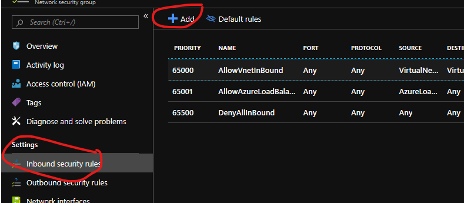

    * Source: IP Address
    * Source IP Addresses/CIDR ranges: <youripaddress>/32 or range
    * Source port ranges: *
    * Destination: Any
    * Destination port ranges: 3389
    * Protocol: Any
    * Priority: 100
    * Name: RDP_3389_Rule

    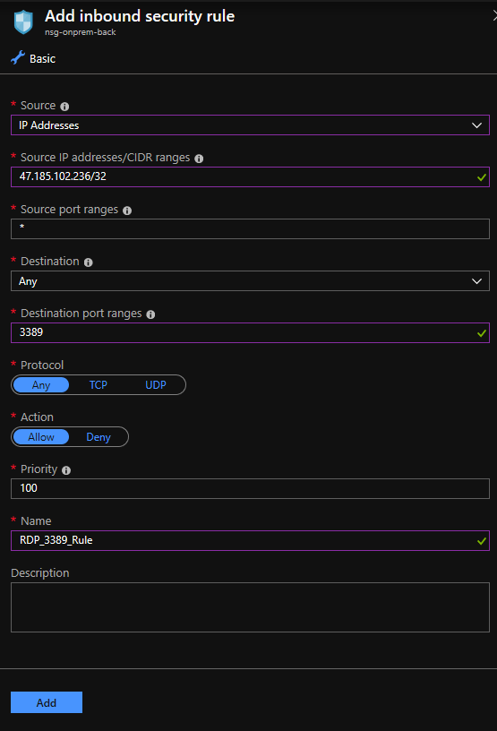

### Create Hub NSG

1. Click on + Create Resource in Portal
1. Type Network Security Group in Search Box
1. Select Network Security Group > Create
    * Name: nsg-hub-back
    * Resource Group: Hub
    * Location: South Central US

        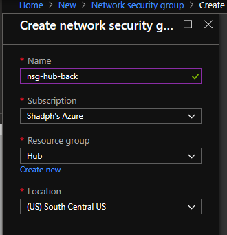

    * Navigate to Hub Resource Group > nsg-hub-back 
    * Click on Subnets > + Associate
    
       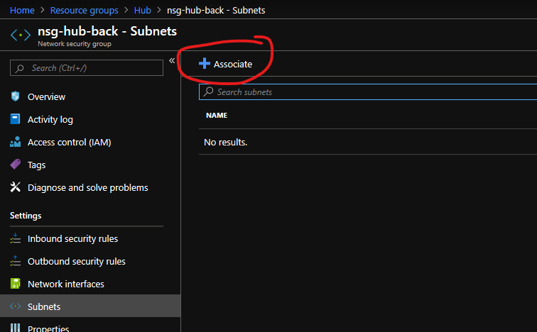

    * Virtual Network: vn-hub
    * Subnet: sn-back

        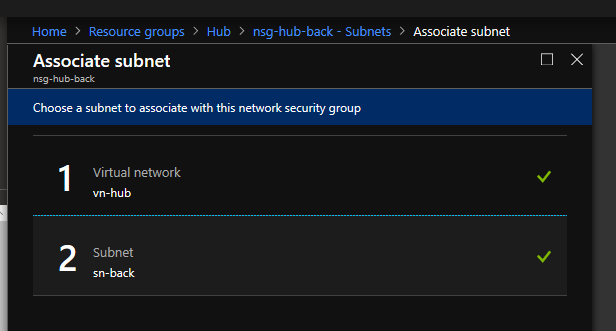

1. Add Inbound RDP Rule from your IP Address
    * Type whatismyipaddress in your favorite search engine, make note of your IP address
    * Click on Inbound Security Rules > + Add

    
    
    * Source: IP Address
    * Source IP Addresses/CIDR ranges: <youripaddress>/32 or range
    * Source port ranges: *
    * Destination: Any
    * Destination port ranges: 3389
    * Protocol: Any
    * Priority: 100
    * Name: RDP_3389_Rule

    

### Create Spoke NSG

1. Click on + Create Resource in Portal
1. Type Network Security Group in Search Box
1. Select Network Security Group > Create
    * Name: nsg-spokea-back
    * Resource Group: SpokeA
    * Location: South Central US

        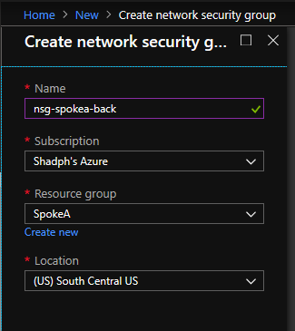

    * Navigate to Hub Resource Group > nsg-spokea-back 
    * Click on Subnets > + Associate
    
       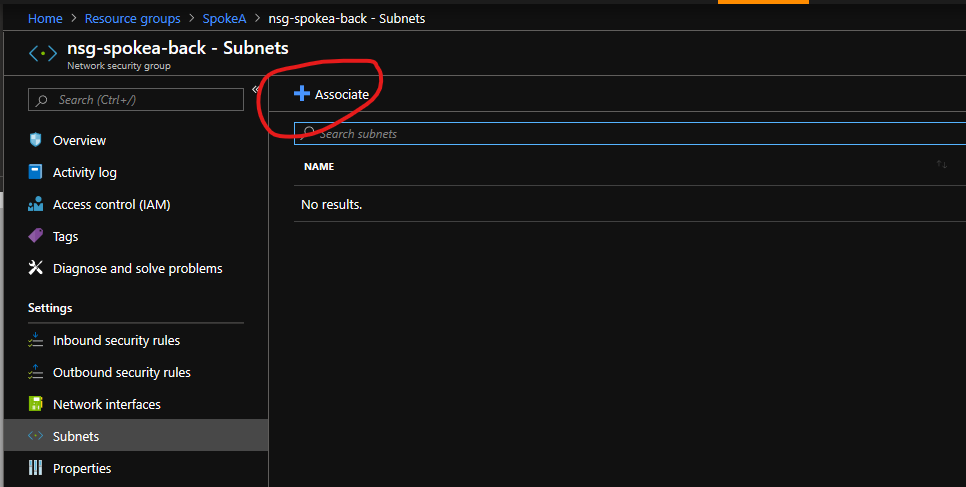

    * Virtual Network: vn-spokea
    * Subnet: sn-back

        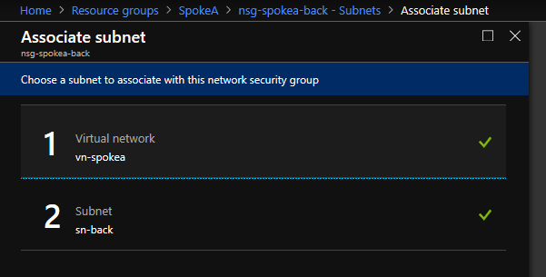
    
1. Add Inbound RDP Rule from your IP Address
    * Type whatismyipaddress in your favorite search engine, make note of your IP address
    * Click on Inbound Security Rules > + Add

    
    
    * Source: IP Address
    * Source IP Addresses/CIDR ranges: <youripaddress>/32 or range
    * Source port ranges: *
    * Destination: Any
    * Destination port ranges: 3389
    * Protocol: Any
    * Priority: 100
    * Name: RDP_3389_Rule

    

## Connect OnPrem to Hub via VPN Tunnel
### [Back to Excercises](#exercises)

### Configure OnPrem VPN Gateway
1. Navigate to OnPrem Resource Group > vng-onprem
1. Click on Connections > + Add

    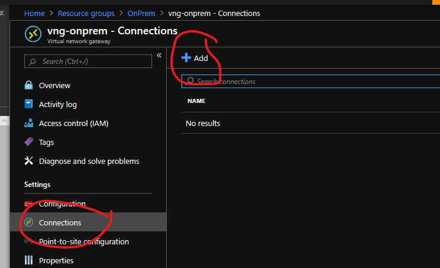

    * Name: connOnPremToHub
    * Connection Type: VNet-to-VNet
    * First virtual network gateway: vng-onprem
    * Second virtual network gateway: vng-hub
    * Shared key (PSK): <yourkey> 
1. Click Ok

    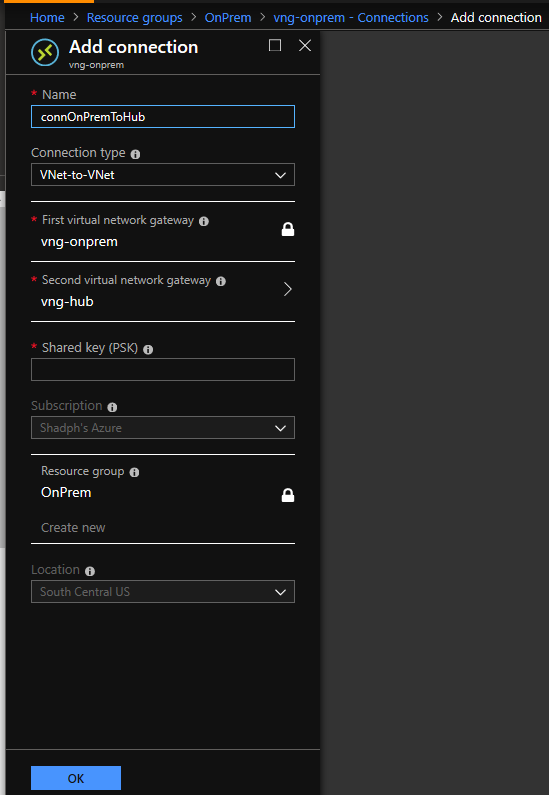

### Configure Hub VPN Gateway
1. Navigate to Hub Resource Group > vng-hub
1. Click on Connections > + Add

    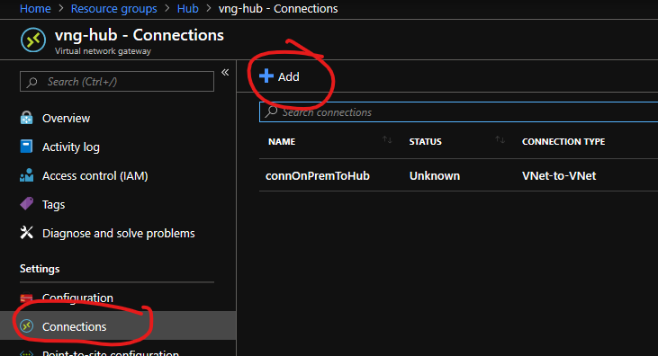

    * Name: connHubToOnPrem
    * Connection Type: VNet-to-VNet
    * First virtual network gateway: vng-hub
    * Second virtual network gateway: vng-onprem
    * Shared key (PSK): <yourkey> (same key as above)
1. Click Ok

    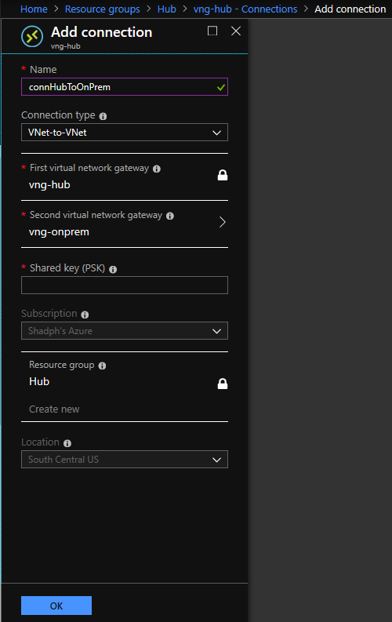

1. After some time you should see the status change to connected for each connection.

    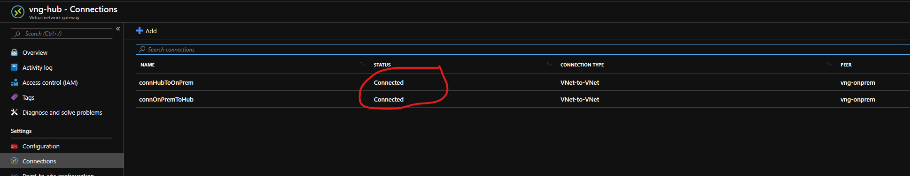

1. Validate the Routes by navigating to the Hub Resource Group > and clicking on the Nick for the vm-hub1 virtual machine.

    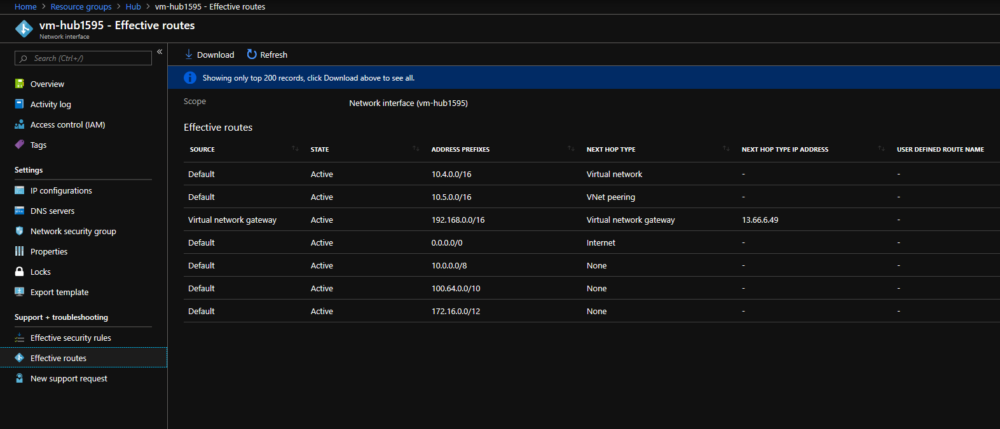

1. Click on the Effective Routes. You should see the routes for the Onprem, Hub, SpokeA, and Internet

    

# Create Azure Firewall
# Create User Defined Routes and Network Routing Rules

