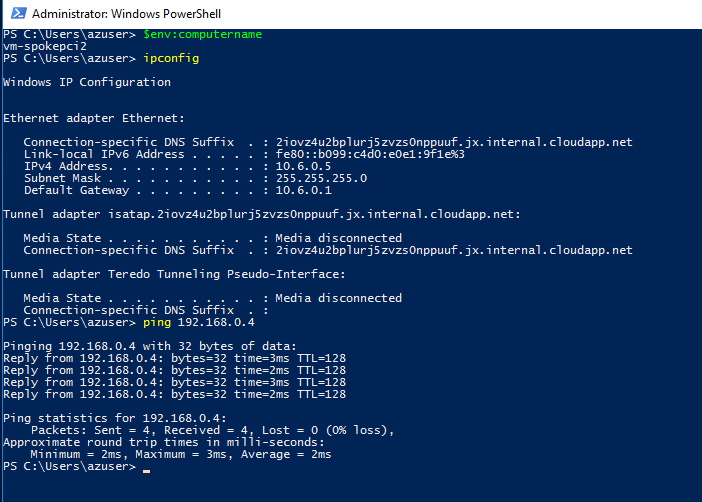
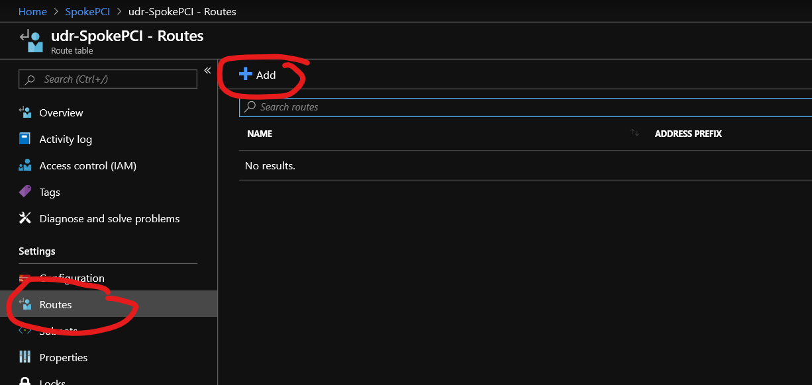

# Azure Networking : Enterprise Hybrid Network
## Overview

Create an Enterprise Hybrid Network with a Hub and Spoke Topology in the Azure Portal

## Hybrid Hub and Spoke Topology


# Exercises
## [Back to Excercises](#exercises)

* [Create Virtual Networks](#create-virtual-networks)
* [Create VNET Peerings](#create-vnet-peerings)
* [Create Virtual Machines](#create-virtual-machines)
* [Create Network Security Groups](#create-network-security-groups)
* [Connect OnPrem to Hub via VPN Tunnel](#connect-onprem-to-hub-via-vpn-tunnel)
* [Check Connectivity](#check-connectivity)
* [Create Azure Firewall](#create-azure-firewall)
* [Create User Defined Routes and Network Routing Rules](#create-user-defined-routes-and-network-routing-rules)
* [Check SpokeA to Hub to SpokePCI Connectivity](#Check-SpokeA-to-Hub-to-SpokePCI-Connectivity)
* [Create Application Security Groups for Microsegmentation](#Create-Application-Security-Groups-for-Microsegmentation)
* [Network Automation Samples and References](#Network-Automation-Samples-and-References)

# Create Virtual Networks
## [Back to Excercises](#exercises)

* [Create On Premises Network](#create-on-premises-network)
* [Create Hub Network](#create-hub-network)
* [Create SpokeA Network](#create-spokea-network)
* [Create SpokePCI Network](#create-spokepci-network)


## Create On Premises Network

1. Create a Resource Group named OnPrem

1. Create a Virtual Network in the OnPrem Resource Group
    * Name: vn-onprem
    * Address Space: 192.168.0.0/16
    * Resource Group: OnPrem
    * Region: South Central US
    * Subnet: sn-back
    * Subnet Address Range: 192.168.0.0/24
    * Leave other defaults, they can be changed later

1. Add a Gateway Subnet to the OnPrem VNet
    * Click on +Gateway Subnet

    * Accept the Defaults

1. Deploy a VPN Gateway (This will take 30-40 mins)
    * Name: vng-onprem
    * Region: South Central US
    * Gateway Type: VPN
    * VPN Type: Route-Based
    * SKU: VpnGw1
    * Virtual Network: vn-onprem

    * Create a new Public IP Address
    * Name: pip-vng-onprem
    * Leave all other defaults

    * Click Review & Create > Create

## Create Hub Network
### [Back to Excercises](#exercises)

1. Create a Resource Group named Hub

1. Create a Virtual Network in the Hub Resource Group
    * Name: vn-hub
    * Address Space: 10.4.0.0/16
    * Resource Group: Hub
    * Region: South Central US
    * Subnet: sn-back
    * Subnet Address Range: 10.4.0.0/24
    * Leave other defaults, they can be changed later

1. Add a Gateway Subnet to the Hub VNet
    * Click on +Gateway Subnet

    * Accept the Defaults

1. Deploy a VPN Gateway (This will take 30-40 mins)
    * Name: vng-hub
    * Region: South Central US
    * Gateway Type: VPN
    * VPN Type: Route-Based
    * SKU: VpnGw1
    * Virtual Network: vn-hub

    * Create a new Public IP Address
    * Name: pip-vng-hub
    * Leave all other defaults

    * Click Review & Create > Create

## Create SpokeA Network
### [Back to Excercises](#exercises)

1. Create a Resource Group named SpokeA

1. Create a Virtual Network in the SpokeA Resource Group
    * Name: vn-spokea
    * Address Space: 10.5.0.0/16
    * Resource Group: SpokeA
    * Region: South Central US
    * Subnet: sn-back
    * Subnet Address Range: 10.5.0.0/24
    * Leave other defaults, they can be changed later


## Create SpokePCI Network
### [Back to Excercises](#exercises)

1. Create a Resource Group named SpokePCI

1. Create a Virtual Network in the SpokePCI Resource Group
    * Name: vn-spokepci
    * Address Space: 10.6.0.0/16
    * Resource Group: SpokePCI
    * Region: South Central US
    * Subnet: sn-back
    * Subnet Address Range: 10.6.0.0/24
    * Leave other defaults, they can be changed later


# Create VNET Peerings
## [Back to Excercises](#exercises)
* [Create Hub to Spoke Peering](#create-hub-to-spokea-peering)
* [Validate Spoke to Hub Peering](#validate-spoke-to-hub-peering)


## Create Hub to Spoke Peering
    * Goal is to be able to get from SpokeA to OnPrem through the Hub
1. Navigate to the Hub Resource Group > vn-hub > peering > + Add

    * Name of peering from vn-hub to vn-spokea: pr-HubToSpokeA
    * Virtual Netowrk: vn-spokea
    * Name of peering from vn-spokea to vn-hub: pr-SpokeAToHub
    * Allow virutal network acess: Enabled
    * Allow Forwarded traffic from vn-hub to vn-spokea: Enabled
    * Allow Forwarded traffic from vn-spokea to vn-hub: Diabled
    * Allow Gateway transit: Checked


1. Navigate to the Hub Resource Group > vn-hub > peering > + Add

    * Name of peering from vn-hub to vn-spokepci: pr-HubToSpokePCI
    * Virtual Netowrk: vn-spokea
    * Name of peering from vn-spokea to vn-hub: pr-SpokePCIToHub
    * Allow virutal network acess: Enabled
    * Allow Forwarded traffic from vn-hub to vn-spokepci: Enabled
    * Allow Forwarded traffic from vn-spokepci to vn-hub: Diabled
    * Allow Gateway transit: Checked    


## Validate Spoke to Hub Peering
### [Back to Excercises](#exercises)

* Goal it to be able to get from SpokeA to SpokePCI and vise versa through the Hub
1. Navigate to the SpokeA Resource Group > vn-spokea > peering 
    * Let's validate that the peering is enabled correctly. You should see pr-SpokeAToHub

    * Click on pr-SpokeAToHub. You should see that "Use remote gateways" is checked.

1. Navigate to the SpokeA Resource Group > vn-spokepci > peering 
    * Let's validate that the peering is enabled correctly. You should see pr-SpokePCIToHub

    * Click on pr-SpokePCIToHub. You should see that "Use remote gateways" is checked.


# Create Virtual Machines
## [Back to Excercises](#exercises)

* [Create OnPrem VM](#create-onprem-vm)
* [Create Hub VM](#create-hub-vm)
* [Create SpokeA VM](#create-spokea-vm)
* [Create SpokePCI VMs](#create-spokepci-vms)


## Create OnPrem VM
1. Click on + Create Resource in Portal
1. Choose Windows Server 2016 Datacenter
1. Basic Config
    * Resource Group: OnPrem
    * VM NAme: vm-onprem1
    * Region: South Central US
    * Availability Options: No infrastructure redundancy required
    * Image: Windows Server 2016 Datacenter
    * Size: Standard DS1 v2
    * UserName: <yourusername>
    * Password: <strongpassword>
    * Public inbound ports: Allowed Selected Ports (RDP)

1. Disks
    * Leave Defaults

1. Network
    * Virtual Network: vn-onprem
    * Subnet: sn-back
    * Public IP: defalut (new vm-onprem1-ip)
    * Network Security Group: None (we'll add one to the VNET/Subnet Later)
    * Leave all other defaults

1. Click on Review + create > Create

## Create Hub VM
1. Click on + Create Resource in Portal
1. Choose Windows Server 2016 Datacenter
1. Basic Config
    * Resource Group: Hub
    * VM NAme: vm-hub1
    * Region: South Central US
    * Availability Options: No infrastructure redundancy required
    * Image: Windows Server 2016 Datacenter
    * Size: Standard DS1 v2
    * UserName: <yourusername>
    * Password: <strongpassword>
    * Public inbound ports: Allowed Selected Ports (RDP)

1. Disks
    * Leave Defaults

1. Network
    * Virtual Network: vn-hub
    * Subnet: sn-back
    * Public IP: defalut (new vm-hub1-ip)
    * Network Security Group: None (we'll add one to the VNET/Subnet Later)
    * Leave all other defaults

1. Click on Review + create > Create

## Create SpokeA VM
1. Click on + Create Resource in Portal
1. Choose Windows Server 2016 Datacenter
1.  Basic Config
    * Resource Group: SpokeA
    * VM NAme: vm-spokea1
    * Region: South Central US
    * Availability Options: No infrastructure redundancy required
    * Image: Windows Server 2016 Datacenter
    * Size: Standard DS1 v2
    * UserName: <yourusername>
    * Password: <strongpassword>
    * Public inbound ports: Allowed Selected Ports (RDP)

1. Disks
    * Leave Defaults

1. Network
    * Virtual Network: vn-spokea
    * Subnet: sn-back
    * Public IP: defalut (new vm-spokea1-ip)
    * Network Security Group: None (we'll add one to the VNET/Subnet Later)
    * Leave all other defaults

1. Click on Review + create > Create

## Create SpokePCI VMs
1. Click on + Create Resource in Portal
1. Choose Windows Server 2016 Datacenter
1.  Basic Config
    * Resource Group: SpokePCI
    * VM NAme: vm-spokepci1
    * Region: South Central US
    * Availability Options: No infrastructure redundancy required
    * Image: Windows Server 2016 Datacenter
    * Size: Standard DS1 v2
    * UserName: <yourusername>
    * Password: <strongpassword>
    * Public inbound ports: Allowed Selected Ports (RDP)

1. Disks
    * Leave Defaults

1. Network
    * Virtual Network: vn-spokepci
    * Subnet: sn-back
    * Public IP: defalut (new vm-spokepci1-ip)
    * Network Security Group: None (we'll add one to the VNET/Subnet Later)
    * Leave all other defaults

1. Click on Review + create > Create
1. Repeat the previous 6 steps to create a 2nd VM in the vn-spokepci VNet. However, this time replace the name of the vm name with: <b>vm-spokepci2</b>

# Create Network Security Groups
## [Back to Excercises](#exercises)

* [Create OnPrem NSG](#create-onprem-nsg)
* [Create Hub NSG](#create-hub-nsg)
* [Create SpokeA NSG](#create-spokea-nsg)
* [Create SpokePCI NSG](#create-spokepci-nsg)

## Create OnPrem NSG

1. Click on + Create Resource in Portal
1. Type Network Security Group in Search Box
1. Select Network Security Group > Create
    * Name: nsg-onprem-back
    * Resource Group: OnPrem
    * Location: South Central US

    * Navigate to OnPrem Resource Group > nsg-onprem-back 
    * Click on Subnets > + Associate  

    * Virtual Network: vn-onprem
    * Subnet: sn-back

1. Add Inbound RDP Rule from your IP Address
    * Type whatismyipaddress in your favorite search engine, make note of your IP address
    * Click on Inbound Security Rules > + Add

    * Source: IP Address
    * Source IP Addresses/CIDR ranges: <youripaddress>/32 or range
    * Source port ranges: *
    * Destination: Any
    * Destination port ranges: 3389
    * Protocol: Any
    * Priority: 100
    * Name: RDP_3389_Rule


### Create Hub NSG

1. Click on + Create Resource in Portal
1. Type Network Security Group in Search Box
1. Select Network Security Group > Create
    * Name: nsg-hub-back
    * Resource Group: Hub
    * Location: South Central US

    * Navigate to Hub Resource Group > nsg-hub-back 
    * Click on Subnets > + Associate    

    * Virtual Network: vn-hub
    * Subnet: sn-back

1. Add Inbound RDP Rule from your IP Address
    * Type whatismyipaddress in your favorite search engine, make note of your IP address
    * Click on Inbound Security Rules > + Add
    
    * Source: IP Address
    * Source IP Addresses/CIDR ranges: <youripaddress>/32 or range
    * Source port ranges: *
    * Destination: Any
    * Destination port ranges: 3389
    * Protocol: Any
    * Priority: 100
    * Name: RDP_3389_Rule


### Create SpokeA NSG

1. Click on + Create Resource in Portal
1. Type Network Security Group in Search Box
1. Select Network Security Group > Create
    * Name: nsg-spokea-back
    * Resource Group: SpokeA
    * Location: South Central US

    * Navigate to Hub Resource Group > nsg-spokea-back 
    * Click on Subnets > + Associate    

    * Virtual Network: vn-spokea
    * Subnet: sn-back
    
1. Add Inbound RDP Rule from your IP Address
    * Type whatismyipaddress in your favorite search engine, make note of your IP address
    * Click on Inbound Security Rules > + Add
    
    * Source: IP Address
    * Source IP Addresses/CIDR ranges: <youripaddress>/32 or range
    * Source port ranges: *
    * Destination: Any
    * Destination port ranges: 3389
    * Protocol: Any
    * Priority: 100
    * Name: RDP_3389_Rule


### Create SpokePCI NSG

1. Click on + Create Resource in Portal
1. Type Network Security Group in Search Box
1. Select Network Security Group > Create
    * Name: nsg-spokepci-back
    * Resource Group: SpokePCI
    * Location: South Central US

    * Navigate to Hub Resource Group > nsg-spokepci-back 
    * Click on Subnets > + Associate    

    * Virtual Network: vn-spokepci
    * Subnet: sn-back
    
1. Add Inbound RDP Rule from your IP Address
    * Type whatismyipaddress in your favorite search engine, make note of your IP address
    * Click on Inbound Security Rules > + Add
    
    * Source: IP Address
    * Source IP Addresses/CIDR ranges: <youripaddress>/32 or range
    * Source port ranges: *
    * Destination: Any
    * Destination port ranges: 3389
    * Protocol: Any
    * Priority: 100
    * Name: RDP_3389_Rule


## Connect OnPrem to Hub via VPN Tunnel
## [Back to Excercises](#exercises)

### Configure OnPrem VPN Gateway
1. Navigate to OnPrem Resource Group > vng-onprem
1. Click on Connections > + Add

    * Name: connOnPremToHub
    * Connection Type: VNet-to-VNet
    * First virtual network gateway: vng-onprem
    * Second virtual network gateway: vng-hub
    * Shared key (PSK): <yourkey> 
1. Click Ok

### Configure Hub VPN Gateway
1. Navigate to Hub Resource Group > vng-hub
1. Click on Connections > + Add
    * 
    * Name: connHubToOnPrem
    * Connection Type: VNet-to-VNet
    * First virtual network gateway: vng-hub
    * Second virtual network gateway: vng-onprem
    * Shared key (PSK): <yourkey> (same key as above)
1. Click Ok
    * 
1. After some time you should see the status change to connected for each connection.
    * 
1. Validate the Routes by navigating to the Hub Resource Group > and clicking on the Nick for the vm-hub1 virtual machine.
    * 
1. Click on the Effective Routes. You should see the routes for the Onprem, Hub, SpokeA, and Internet
    * 

# Check Connectivity
## [Back to Excercises](#exercises)
1. RDP into the following VMs
    * vm-onprem1 
    * vm-hub1 
    * vm-spokea1
    * vm-spokepci1
    * vm-spokepci2
1. You will need to enable icmp or disable the guest firewall on the OS.
    * To enable icmp you can run the following command from PowerShell (Run as Administrator) on each Virtual Machine
    ```powershell
    New-NetFirewallRule –DisplayName “Allow ICMPv4-In” –Protocol ICMPv4
    ```
1. Ping test from vm-onprem1 to vm-hub1, vm-spokea1, vm-spokepci1, vm-spokepci2
    * 
1. Ping test from vm-hub1, vm-spokea1, vm-spokepci1, vm-spokepci2 to vm-onprem1
    * 
    * 
    * 
    * 
1. Validate that SpokeA cannot communicate with SpokePCI and vice versa
    * Ping test from vm-spokea1 to vm-spokepci1
        * 
    * Ping test from vm-spokepci1 to vm-spokea1
        * 

# Create Azure Firewall
## [Back to Excercises](#exercises)

1. Click on + Create Resource in Portal
1. Type firewall in the search box 
1. Create an AzureFirewallSubnet in the vn-hub virtual network
    * 
1. Type Firewall Group in Search Box
    * Resource group: Hub
    * Name: azfw-hub
    * Region: South Central US
    * Choose a virtual network: Use Existing
    * Virtual Network: vn-hub
    * Public IP address: Create new
    * Public IP address name: azureFirewalls-ip
1. Navigate to the created Azure Firewall and note the Private IP Address
    * 


# Create User Defined Routes and Network Routing Rules
## [Back to Excercises](#exercises)
## Create User Defined Routes

### Create SpokeA User Defined Route Table
1. Click on + Create Resource in Portal
1. Type Route Table in the search box
1. Click Route Table > Create
    * Name: udr-SpokeA
    * Resource Group SpokeA
    * Location: South Central US
    * Virtual network gateway route propagation: Enabled
    * 
1. Navigate to the created route table and create a new Route
    * 
    * Route Name: routeSpokeAToHubFW
    * Address Prefix: 10.6.0.0/16
    * Next Hop Type: Virtual Appliance
    * Next Hop Address: 10.4.2.4
    * 
1. Now associate the route table to the sn-back subnet in vn-spokea
    * 
    * Virtual Network: vn-spokea
    * Subnet: sn-back
    * 

### Create SpokePCI User Defined Route Table
1. Click on + Create Resource in Portal
1. Type Route Table in the search box
1. Click Route Table > Create
    * Name: udr-SpokePCI
    * Resource Group SpokePCI
    * Location: South Central US
    * Virtual network gateway route propagation: Enabled
    * 
1. Navigate to the created route table and create a new Route
    * 
    * Route Name: routeSpokePCIToHubFW
    * Address Prefix: 10.5.0.0/16
    * Next Hop Type: Virtual Appliance
    * Next Hop Address: 10.4.2.4
    * 
1. Now associate the route table to the sn-back subnet in vn-spokea
    * 
    * Virtual Network: vn-spokepci
    * Subnet: sn-back
    * 

### Create Azure Firewall Network Rule
1. Navigate to the Azure Firewall and create a network rule
    * 
    * Name: firewallRule
    * Priority: 100
    * Action: Allow
    * Rules 1:
        * Name: SpokeA-To-SpokePCI
        * Protocol: Any
        * Source Addresses: 10.5.0.0/16
        * Destination Addresses: 10.6.0.0/16
        * Destination Ports: * 
    * Rules 2:
        * Name: SpokePCI-To-SpokeA
        * Protocol: Any
        * Source Addresses: 10.6.0.0/16
        * Destination Addresses: 10.5.0.0/16
        * Destination Ports: *
    * 

# Check SpokeA to Hub to SpokePCI Connectivity
## [Back to Excercises](#exercises)
* Let's validate that we can now route traffic from SpokeA to SpokePCI and vice vera
1. RDP into the following VMs
    * vm-spokea1
    * vm-spokepci1
    * vm-spokepci2
1. You will need to enable icmp or disable the guest firewall on the OS.
    * To enable icmp you can run the following command from PowerShell (Run as Administrator) on each Virtual Machine
    ```powershell
    New-NetFirewallRule –DisplayName “Allow ICMPv4-In” –Protocol ICMPv4
    ```
1. Ping test from vm-spokea1 to vm-spokepci1 and vm-spokepci2
    * 
1. Ping test from vm-spokepci1, vm-spokepci2 to vm-spokea1
    * 
    * 


# Create Application Security Groups for Microsegmentation
## [Back to Excercises](#exercises)

* Goal is to create Microsegmentation between vm-spokepci1 and vm-spokepci2. We do not want them to be able to communicate with each other. So we will use Application Security Groups (ASGs) to accomplish this.

## Create ASG for vm-spokepci1
1. Click on + Create Resource in Portal
1. Type Application Secruity Group in the Search Box
1. Select Application Security Group > Create
    * Resource Group: SpokePCI
    * Name: asg-vm-spokepci1
    * Region: South Central US
    * 
1. Click on + Create Resource in Portal
1. Select Application Security Group > Create
    * Resource Group: SpokePCI
    * Name: asg-vm-spokepci2
    * Region: South Central US
    * 
1. Validate Connectivity between vm-spokepci1 and vm-spokepcivm2
    * 
    * 

## Associate the VMs with the ASGs
1. Associate vm-spokepci1 to asg-spokepci1
1. Navigate to vm-spokepci1 > Networking > Application Secruity Groups >  Configure the applicaiton security groups
    * 
    * Select asg-vm-spokepci1 and click Save
    * 
1. Navigate to vm-spokepci2 > Networking > Application Secruity Groups >  Configure the applicaiton security groups
    * 
    * Select asg-vm-spokepci2 and click Save
    * 

## Create NSG Rules using ASGs for Microsegmentation
1. Navigate to nsg-spokepci-back > Inbound Security Rules > + Add
    * 
    * Source: Application Security Group
    * Source ASG: asg-vm-spokepci1
    * Source port ranges: *
    * Destination: Application Security Group
    * Destination ASG: asg-vm-spokepci2
    * Destination: *
    * Protocol: Any
    * Action: Deny
    * Priority: 110
    * Name: DenyVmspokepci1ToVmspokepci2
    * 
1. Validate Connectivity between vm-spokepci1 and vm-spokepcivm2 has been blocked
    * 
    
# Network Automation Samples and References

## PowerShell
The following table includes links to Azure Powershell scripts:

| | |
|----|----|
| [Create a virtual network for multi-tier applications](https://docs.microsoft.com/en-us/azure/virtual-network/scripts/virtual-network-powershell-sample-multi-tier-application) | Creates a virtual network with front-end and back-end subnets. Traffic to the front-end subnet is limited to HTTP, while traffic to the back-end subnet is limited to SQL, port 1433. |
| [Peer two virtual networks](https://docs.microsoft.com/en-us/azure/virtual-network/scripts/virtual-network-powershell-sample-peer-two-virtual-networks) | Creates and connects two virtual networks in the same region. |
| [Route traffic through a network virtual appliance](https://docs.microsoft.com/en-us/azure/virtual-network/scripts/virtual-network-powershell-sample-route-traffic-through-nva) | Creates a virtual network with front-end and back-end subnets and a VM that is able to route traffic between the two subnets. |
| [Filter inbound and outbound VM network traffic](https://docs.microsoft.com/en-us/azure/virtual-network/scripts/virtual-network-powershell-sample-filter-network-traffic) | Creates a virtual network with front-end and back-end subnets. Inbound network traffic to the front-end subnet is limited to HTTP and HTTPS. Outbound traffic to the internet from the back-end subnet is not permitted. |
|[Configure IPv4 + IPv6 dual stack virtual network](https://docs.microsoft.com/en-us/azure/virtual-network/scripts/virtual-network-powershell-sample-ipv6-dual-stack)|Deploys dual-stack (IPv4+IPv6) virtual network with two VMs and an Azure Basic Load Balancer with IPv4 and IPv6 public IP addresses. |

## CLI
The following table includes links to bash scripts with Azure CLI commands:

| | |
|----|----|
| [Create a virtual network for multi-tier applications](https://docs.microsoft.com/en-us/azure/virtual-network/scripts/virtual-network-cli-sample-multi-tier-application) | Creates a virtual network with front-end and back-end subnets. Traffic to the front-end subnet is limited to HTTP and SSH, while traffic to the back-end subnet is limited to MySQL, port 3306. |
| [Peer two virtual networks](https://docs.microsoft.com/en-us/azure/virtual-network/scripts/virtual-network-cli-sample-peer-two-virtual-networks) | Creates and connects two virtual networks in the same region. |
| [Route traffic through a network virtual appliance](https://docs.microsoft.com/en-us/azure/virtual-network/scripts/virtual-network-cli-sample-route-traffic-through-nva) | Creates a virtual network with front-end and back-end subnets and a VM that is able to route traffic between the two subnets. |
| [Filter inbound and outbound VM network traffic](https://docs.microsoft.com/en-us/azure/virtual-network/scripts/virtual-network-cli-sample-filter-network-traffic) | Creates a virtual network with front-end and back-end subnets. Inbound network traffic to the front-end subnet is limited to HTTP, HTTPS, and SSH. Outbound traffic to the internet from the back-end subnet is not permitted. |
|[Configure IPv4 + IPv6 dual stack virtual network](https://docs.microsoft.com/en-us/azure/virtual-network/scripts/virtual-network-cli-sample-ipv6-dual-stack)|Deploys dual-stack (IPv4+IPv6) virtual network with two VMs and an Azure Basic Load Balancer with IPv4 and IPv6 public IP addresses. |

## Resource Manager Templates
The following table includes links to Azure Resource Manager template samples. 


| | |
|----|----|
|[Create a virtual network with two subnets](https://github.com/Azure/azure-quickstart-templates/tree/master/101-vnet-two-subnets)| Creates a virtual network with two subnets.|
|[Route traffic through a network virtual appliance](https://github.com/Azure/azure-quickstart-templates/tree/master/201-userdefined-routes-appliance)| Creates a virtual network with three subnets. Deploys a virtual machine into each of the subnets. Creates a route table containing routes to direct traffic from one subnet to another through the virtual machine in the third subnet. Associates the route table to one of the subnets.|
|[Create a virtual network service endpoint for Azure Storage](https://github.com/Azure/azure-quickstart-templates/tree/master/201-vnet-2subnets-service-endpoints-storage-integration)|Creates a new virtual network with two subnets, and a network interface in each subnet. Enables a service endpoint to Azure Storage for one of the subnets and secures a new storage account to that subnet.|
|[Connect two virtual networks](https://github.com/Azure/azure-quickstart-templates/tree/master/201-vnet-to-vnet-peering)| Creates two virtual networks and a virtual network peering between them.|
|[Create a virtual machine with multiple IP addresses](https://github.com/Azure/azure-quickstart-templates/tree/master/101-vm-multiple-ipconfig)| Creates a Windows or Linux VM with multiple IP addresses.|
|[Configure IPv4 + IPv6 dual stack virtual network](https://github.com/Azure/azure-quickstart-templates/tree/master/ipv6-in-vnet)|Deploys dual-stack (IPv4+IPv6) virtual network with two VMs and an Azure Basic Load Balancer with IPv4 and IPv6 public IP addresses. |

## Azure Policy 
The following table includes links to [Azure Policy](../governance/policy/overview.md?toc=%2fazure%2fvirtual-network%2ftoc.json) samples. The samples are found in the [Azure Policy samples repository](https://github.com/Azure/azure-policy).

| | |
|---|---|
|**Network**||
| [NSG X on every NIC](https://docs.microsoft.com/en-us/azure/governance/policy/samples/nsg-on-nic?toc=%2fazure%2fvirtual-network%2ftoc.json) | Requires that a specific network security group is used with every virtual network interface. You specify the ID of the network security group to use. |
| [NSG X on every subnet](https://docs.microsoft.com/en-us/azure/governance/policy/samples/nsg-on-subnet?toc=%2fazure%2fvirtual-network%2ftoc.json) | Requires that a specific network security group is used with every virtual subnet. You specify the ID of the network security group to use. |
| [No route table](https://docs.microsoft.com/en-us/azure/governance/policy/samples/no-user-defined-route-table?toc=%2fazure%2fvirtual-network%2ftoc.json)  |Prohibits virtual networks from being deployed with a route table. |
| [Use approved subnet for VM network interfaces](https://docs.microsoft.com/en-us/azure/governance/policy/samples/use-approved-subnet-vm-nics?toc=%2fazure%2fvirtual-network%2ftoc.json) | Requires that network interfaces use an approved subnet. You specify the ID of the approved subnet. |
| [Use approved vNet for VM network interfaces](https://docs.microsoft.com/en-us/azure/governance/policy/samples/use-approved-vnet-vm-nics?toc=%2fazure%2fvirtual-network%2ftoc.json) | Requires that network interfaces use an approved virtual network. You specify the ID of the approved virtual network. |
|**Monitoring**||
| [Audit diagnostic setting](https://docs.microsoft.com/en-us/azure/governance/policy/samples/audit-diagnostic-setting?toc=%2fazure%2fvirtual-network%2ftoc.json) | Audits if diagnostic settings are not enabled for specified resource types. You specify an array of resource types to check whether diagnostic settings are enabled. |
|**Name and text conventions**||
| [Allow multiple name patterns](https://docs.microsoft.com/en-us/azure/governance/policy/samples/allow-multiple-name-patterns?toc=%2fazure%2fvirtual-network%2ftoc.json) | Allow one of many name patterns to be used for resources. |
| [Require like pattern](https://docs.microsoft.com/en-us/azure/governance/policy/samples/enforce-like-pattern?toc=%2fazure%2fvirtual-network%2ftoc.json) | Ensure resource names meet the *like* condition for a pattern. |
| [Require match pattern](https://docs.microsoft.com/en-us/azure/governance/policy/samples/enforce-match-pattern?toc=%2fazure%2fvirtual-network%2ftoc.json) | Ensure resource names match a specified naming pattern. |
| [Require tag match pattern](https://docs.microsoft.com/en-us/azure/governance/policy/samples/enforce-tag-match-pattern?toc=%2fazure%2fvirtual-network%2ftoc.json) | Ensure that a tag value matches a text pattern. |
|**Tags**||
| [Billing tags policy initiative](https://docs.microsoft.com/en-us/azure/governance/policy/samples/billing-tags-policy-initiative?toc=%2fazure%2fvirtual-network%2ftoc.json) | Requires specified tag values for cost center and product name. Uses built-in policies to apply and enforce required tags. You specify the required values for the tags.  |
| [Enforce tag and its value on resource groups](https://docs.microsoft.com/en-us/azure/governance/policy/samples/enforce-tag-on-resource-groups?toc=%2fazure%2fvirtual-network%2ftoc.json) | Requires a tag and value on a resource group. You specify the required tag name and value.  |
| [Enforce tag and its value](https://docs.microsoft.com/en-us/azure/governance/policy/samples/enforce-tag-value?toc=%2fazure%2fvirtual-network%2ftoc.json) | Requires a specified tag name and value. You specify the tag name and value to enforce.  |
| [Apply tag and its default value](https://docs.microsoft.com/en-us/azure/governance/policy/samples/apply-tag-default-value?toc=%2fazure%2fvirtual-network%2ftoc.json) | Appends a specified tag name and value, if that tag is not provided. You specify the tag name and value to apply.  |
|**General**||
| [Allowed locations](https://docs.microsoft.com/en-us/azure/governance/policy/samples/allowed-locations?toc=%2fazure%2fvirtual-network%2ftoc.json) | Requires that all resources are deployed to the approved locations. You specify an array of approved locations.  |
| [Allowed resource types](https://docs.microsoft.com/en-us/azure/governance/policy/samples/allowed-resource-types?toc=%2fazure%2fvirtual-network%2ftoc.json) | Ensures only approved resource types are deployed. You specify an array of resource types that are permitted.  |
| [Not allowed resource types](https://docs.microsoft.com/en-us/azure/governance/policy/samples/not-allowed-resource-types?toc=%2fazure%2fvirtual-network%2ftoc.json) | Prohibits the deployment of specified resource types. You specify an array of the resource types to block.  |
